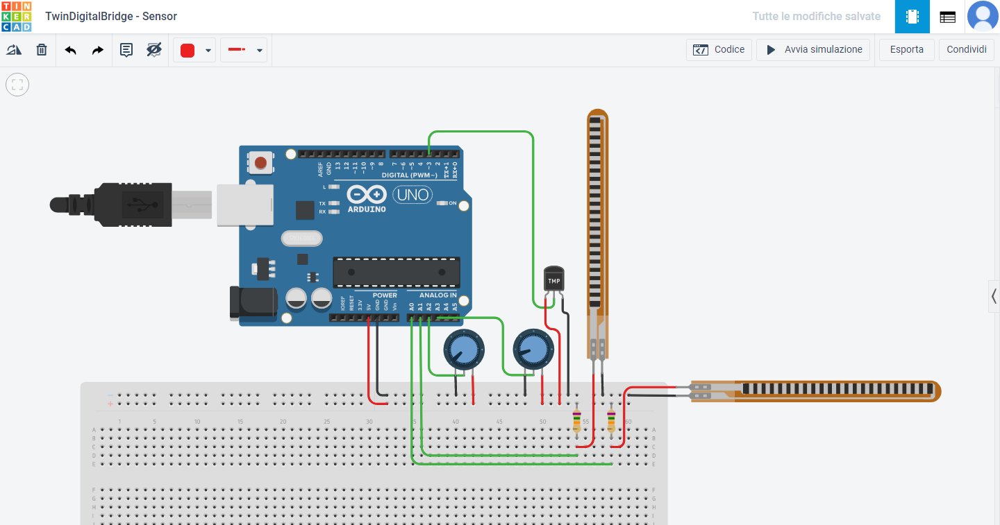

# IoT-Twin-Digital-Bridge

## Project for the Internet of Things course 2020/2021 Universita' di Genova
#### By Arezou Ranjbarpour Maralani & Lorenzo Tibaldi 

* [Introduction](#introduction)
* Main parts
  * [The system backbone](#the-system-backbone)
  * [The sensors' design](#the-sensors-design)
  * [The system persistency](#the-system-persistency)
  * [The system dashboard](#the-system-dashboard)
* [Final remarks](#final-remarks)
* [Try it yourself](#try-it-yourself)

## Introduction
The goal of this project was to create a prototype for a realtime infrastructure monitoring system.

In particular the focus was on the implementation of an IoT system that would let the user monitor readings coming from an array of sensors attached to piles of a bridge and at the same time offering an interface that could let them customize alert notifications based on these readings.

The project can be divided into 4 parts:
* The system backbone
* The sensors' design
* The system persistency
* The system dashboard

## The system backbone 
 + 

The backbone has been developed with Node-red, a visual programming tool that makes creating projects like this much easier.

When the Node-red builtin nodes wouldn't work for a specific use case (and that's, most of the time, inevitable) it is possible to write javascript (Nodejs) code in the builtin `function node`.

This is the main node-red flow that handles most of the logic of the system.

The flow can be split horizontaly in 2 parts:
* The sensor simulation part
* The actual logic part

The first part is designed as a developer tool to test a sensor reading, it is completely customizable so that the logic of alert triggering could also be tested with it.

The second part consists of:
* Inserting a timestamp to the reading. (to reduce the complexity of the sensors, they themselves cannot timestamp a reading before sending it)
* Sending the command to insert the reading in the database.
  * If one of the sensors malfunctions, sending the command to update that sensor in the database.
* Sending a command to retrieve all the alerts of the system.
  * If one, or more, alerts are triggered by this reading, notifying the user.

## The sensors' design
 + 

The design required 2 steps:
* In Tinkercad, design the hardware of a single sensor.
* Write the code that each arduino Uno would run to send the sensors' readings to the system.

The specifications required: 2 sensors for rotation, 1 sensor for temperature and humidity, 1 sensor for wind speed (anemometer) and 1 sensor for rain amount.

Unfortunately...
* Tinkercad does not yet provide an anemometer, DHT22 (temperature and humidity sensor) or a rain sensor.
* Since communication was needed, our sensors require an Ethernet Shield that is also absent from Tinkercad.
* Furthermore, using an Ethernet shield and the JSON file format (more of that later) meant that 2 additional libraries had to be used, that Tinkercad could not import.
* Lastly we did not have an Arduino to test any of the code in real life.

What we were able to do:
* Design the hardware as best as possible, by substituting the missing sensors with potentiometers and the DHT22 for just a temperature sensor.
* Writing the code so that it might be as close to compilable as possible, without any guarantee because of the lack of hardware in real life for testing.

[Here is the Tinkercad link](https://www.tinkercad.com/things/iA9xcBoBmd5-twindigitalbridge-sensor)

**To Note:**

The hardware missing in the schematics are:

The Ethernet shield for the MQTT communication

An Anemometer to measure wind speed (substituting a potentiometer)

A rain sensor to measure the rain amount (substituting the other potentiometer)

Lastly a DHT22 sensor for temperature and humidity (substituting the temperature sensor)
 
 ## The system persistency
 + 
 
 The persistent part of the system evolved from using node-red variables, to using an actual SQLite file in the same network and lastly to take advantage of the MQTT protocol to create a database infrastructure that could easily be distributed.
 
 A single SQLite file contains the 3 tables needed for the system:
 * The sensor table
 * The alerts table
 * The measurements table

The contents of all of these are self-explanatory and a flow can also be accessed by an administrator of the system to perform actions on the database. (like wiping, recreating and populating with a small group of test entries)

This is the flow that handles the commands sent to the database and the entries returned by them, alongside the administrator part. (with node-red buttons)

The database is populated with a very small toy example, it can be wiped, created and repopulated from this persistency flow.

## The system dashboard
 + 

The development of the dashboard takes advantage of the easy to use Node-red dashboard nodes

For our specific use cases there were a few instances where we had to take advantage of the powerful `template node`, that let us write some angularjs code to meet our needs.

The most important `template node` was used during the creation of the alert form.

We needed to put together a form that would only create alerts if they are in the valid format:
* Non empty submitter and message fields
* At least one condition required
* Any condition must be complete (e.g. "temperature less than" MUST be followed by a valid number)
* Either all sensors should be checked OR a sensor must be specified

This is a part of said template node for the alert form.

## Final remarks
* About the communications between parts:
   * Everything takes advantage of the very efficient MQTT protocol, the sensors send a single lightweght JSON file and the different topics keep the information flow ordered and correct.
 * About the Node-red libraries:
   * We felt like it made no sense to write completely from scratch the details for visualization, persistency or utilities; in the next section you will find a list of all the libraries that have been used.
 * About possible future improvements:
    * There are many, here's some:
       * Make the Node-red parts of the system secure
       * Separate the main machine from the dashboard, by implementing some consistency policy
       * Test, compile, fix and improve the sensor part, since we weren't able to do it at all
       * Figure out a smart solution for the detection of malfunctioning sensors
       * Increasing the power over the database of an admin, data removal, sorting or even on the fly tables restructurings
       * Distribute the data on multiple databases and protect it, for example with redundancy
       * Take the necessary precautions to render safe the MQTT connects, currently anyone that knows the topic could eavesdrop
       * Move away from the public mosquitto broker
 * What about a demo?
   * In the same directory it is possible to find:
       * A powerpoint presentation of the project
       * A video demo of the project and code 
## Try it yourself

Requires:
 * [Node-red](https://nodered.org/)
 * [Node-red Dashboard](https://flows.nodered.org/node/node-red-dashboard)
 * [The Table node](https://flows.nodered.org/node/node-red-node-ui-table)
 * [The Date formatter node](https://flows.nodered.org/node/node-red-contrib-moment)
 * [The SQLite node](https://flows.nodered.org/node/node-red-node-sqlite)

To run:
* Open node-red from terminal **in the directory "IoT-Twin-Digital-Bridge"**.
* Open localhost:1880 for the flows and localhost:1880/ui for the dashboard.
* Anything can now be executed from the dashboard alone, the sensors can be simulated in the first tab.

